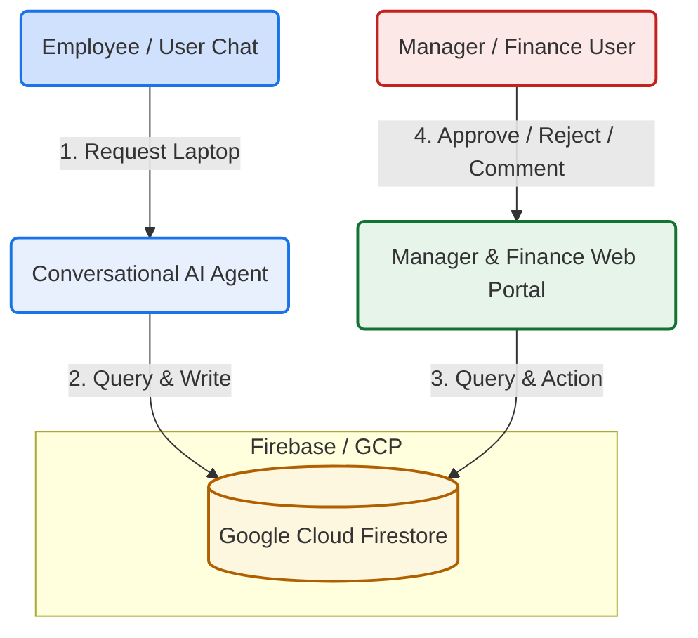
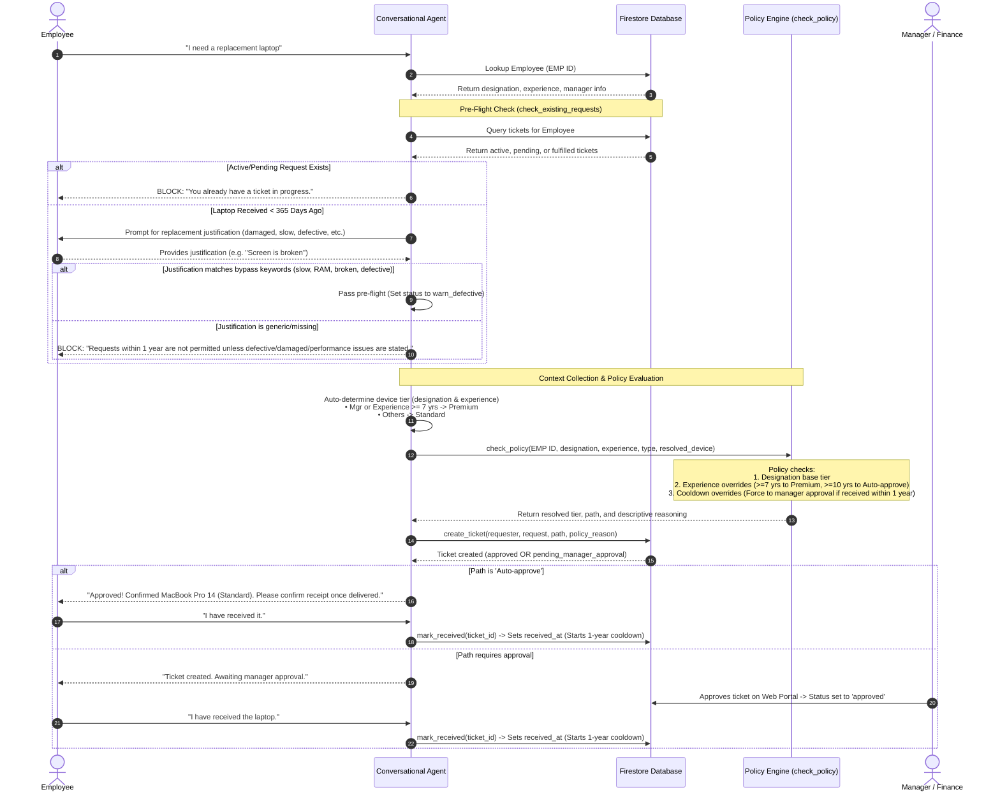
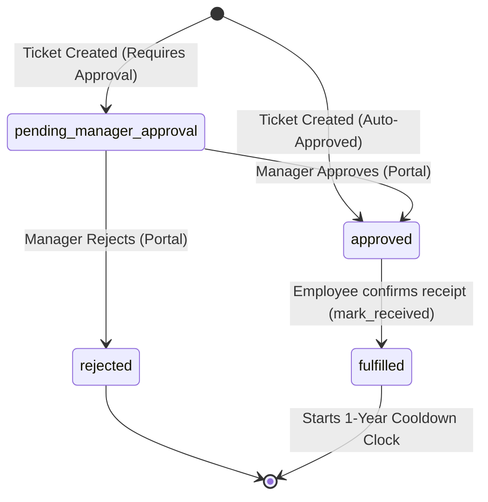

# IT Support Laptop Agent: System Architecture & Workflow Design

This document details the system architecture, data models, and request flows of the IT Support Laptop Request agent.

---

## 1. High-Level System Architecture

The system consists of three main parts:
1. **Conversational Agent (Backend)**: Orchestrates the user experience, checks policy constraints, evaluates eligibility, and creates requests.
2. **Web Portal (Frontend)**: Next.js dashboard where Managers and Finance teams log in using Employee ID to approve, reject, and review ticket histories.
3. **Database Layer (Firestore)**: Single source of truth containing employees, policies, and tickets.



---

## 2. Core Request Flow & Policy Engine

Below is the detailed workflow that executes when an employee requests a laptop. This covers **Pre-Flight Checks**, **Dynamic Device Allocation**, **Cooldown Verification**, and **Approval Routing**.



---

## 3. Web Portal Actions & Lifecycle States

The Web Portal enforces different permissions for **Managers** (who can only see and approve tickets for their direct reports) and **Finance** (who can view and action all tickets).

### Ticket State Transitions


---

## 4. Firestore Data Models

### `employees` collection
```json
{
  "employee_id": "EMP-002",
  "name": "Bob Smith",
  "designation": "Senior Engineer",
  "experience": 8,
  "department": "Engineering",
  "manager": "EMP-005",
  "location": "Remote",
  "cost_center": "CC-ENG-02",
  "employment_type": "Full-time"
}
```

### `tickets` collection
```json
{
  "ticket_id": "LT-2026-61803",
  "created_at": "2026-06-30T12:47:18Z",
  "received_at": "2026-06-30T12:55:00Z",
  "requester": {
    "employee_id": "EMP-002",
    "name": "Bob Smith",
    "designation": "Senior Engineer",
    "manager": "EMP-005"
  },
  "request": {
    "type": "Replacement",
    "device_category": "Premium",
    "justification": "My laptop screen is cracked and damaged",
    "accessories": "None"
  },
  "status": "fulfilled",
  "approved_by": "EMP-005",
  "manager_override": false,
  "policy_reason": "Employee designation 'Senior Engineer' is entitled to MacBook Pro 14 (Standard tier). Device tier upgraded to Premium based on experience override (8 years >= 7). Cooldown is active. Auto-approval revoked; forced to Manager required.",
  "audit_trail": [
    {
      "timestamp": "2026-06-30T12:47:18Z",
      "actor": "employee",
      "action": "request_submitted",
      "details": "User submitted the laptop request."
    },
    {
      "timestamp": "2026-06-30T12:47:18Z",
      "actor": "agent",
      "action": "policy_check_passed",
      "details": "Policy check completed. Path: Manager required. Reason: ..."
    },
    {
      "timestamp": "2026-06-30T12:50:00Z",
      "actor": "manager",
      "action": "approved",
      "details": "Approved via Web Portal."
    },
    {
      "timestamp": "2026-06-30T12:55:00Z",
      "actor": "employee",
      "action": "laptop_received",
      "details": "Employee confirmed receipt. 1-year cooldown starts."
    }
  ]
}
```
